  

## 📌 About Me
- I'm 𝙏𝙪𝙨𝙝𝙖𝙧 𝙍𝙖𝙣𝙟𝙖𝙣 𝘽𝙞𝙨𝙬𝙖𝙡, a Computer Science & Engineering Undergraduate passionate about creating innovative software, AI-powered solutions, and immersive digital experiences. I enjoy solving real-world problems through technology while continuously exploring modern software engineering and emerging innovations.
- With experience in  𝙅𝙖𝙫𝙖𝙎𝙘𝙧𝙞𝙥𝙩 • 𝙋𝙮𝙩𝙝𝙤𝙣 • 𝙅𝙖𝙫𝙖 • 𝙍𝙚𝙖𝙘𝙩 • 𝙁𝙞𝙧𝙚𝙗𝙖𝙨𝙚 • 𝙎𝙪𝙥𝙖𝙗𝙖𝙨𝙚 • 𝙐𝙣𝙞𝙩𝙮, I love turning ideas into scalable, user-focused applications while constantly learning and improving.. 🚀

## 🧠 My Focus Areas
- ◈ 🤖 Artificial Intelligence, AI Agents & LLM Applications
- ◈ 💻 Full-Stack Web & Software Development
- ◈ 🎮 Unity Game Development & Interactive Experiences
- ◈ ⚡ Automation, Modern Development Tools & Productivity
- ◈ ☁️ Cloud Technologies, Firebase & Supabase
- ◈ 🚀 Building Scalable, High-Performance Applications
- ◈ 📚 Continuous Learning, Open Source & Emerging Technologies
- 𝙄 𝙗𝙚𝙡𝙞𝙚𝙫𝙚 𝙩𝙝𝙖𝙩 𝙩𝙝𝙚 𝙗𝙚𝙨𝙩 𝙙𝙚𝙫𝙚𝙡𝙤𝙥𝙚𝙧𝙨 𝙣𝙚𝙫𝙚𝙧 𝙨𝙩𝙤𝙥 𝙡𝙚𝙖𝙧𝙣𝙞𝙣𝙜, 𝙠𝙚𝙚𝙥 𝙚𝙭𝙥𝙚𝙧𝙞𝙢𝙚𝙣𝙩𝙞𝙣𝙜, 𝙖𝙣𝙙 𝙗𝙪𝙞𝙡𝙙 𝙩𝙚𝙘𝙝𝙣𝙤𝙡𝙤𝙜𝙮 𝙩𝙝𝙖𝙩 𝙢𝙖𝙠𝙚𝙨 𝙖 𝙧𝙚𝙖𝙡 𝙞𝙢𝙥𝙖𝙘𝙩. 🚀

## 📊 GitHub Stats & Trophies

  
  

  

  

  

## 🛠️ Languages & Tools

<h3 align="center">Programming Languages</h3>

  &nbsp;&nbsp;&nbsp;&nbsp;&nbsp;&nbsp;
  &nbsp;&nbsp;&nbsp;&nbsp;&nbsp;&nbsp;
  

<h3 align="center">Frontend</h3>

  &nbsp;&nbsp;&nbsp;&nbsp;&nbsp;&nbsp;
  

<h3 align="center">Database</h3>

  

<h3 align="center">DevOps & Cloud</h3>

  

<h3 align="center">Tools</h3>

  &nbsp;&nbsp;&nbsp;&nbsp;&nbsp;&nbsp;
  &nbsp;&nbsp;&nbsp;&nbsp;&nbsp;&nbsp;
  

## 🔗 Connect with Me

  &nbsp;&nbsp;&nbsp;&nbsp;&nbsp;
  &nbsp;&nbsp;&nbsp;&nbsp;&nbsp;
  &nbsp;&nbsp;&nbsp;&nbsp;&nbsp;
  &nbsp;&nbsp;&nbsp;&nbsp;&nbsp;
  

  

  

